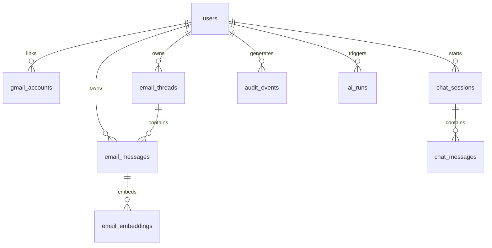

# Submission Description: AI-Powered Gmail Intelligence Platform

## Track: Concierge Agents / Agents for Business
**Project Title:** AI-Powered Gmail Intelligence Platform  
**Author:** Vivek Bogam  
**Repository:** https://github.com/bogavivek15/gmail-intelligence-platform.git  
**Sub-Title:** Secure multi-tenant AI Email Intelligence Platform syncing Gmail with Supabase pgvector, Gemini RAG, and NVIDIA NIM classification.

---

## 1. Executive Summary & Objective

The AI-Powered Gmail Intelligence Platform is a secure, multi-tenant agentic system designed to bridge enterprise email workflows with modern Large Language Models (LLMs) and vector search technology. Constructed as a secure "Concierge Agent" for business professionals, the platform securely ingests, normalizes, embeds, index-searches, categorizes, and generates draft-first email actions.

Managing email consumes nearly a third of a knowledge worker's day. While modern LLMs are capable of drafting responses, summarizing threads, and extracting key tasks, they cannot be deployed directly onto raw, multi-tenant mailboxes due to risk vectors such as cross-tenant data leakage, hallucinated commitments, and authentication hijack vulnerabilities. This platform resolves these hurdles by serving as an Agent Control Plane and Action State Engine that sits between the Google Gmail API, a pgvector Semantic Memory Bank, and LLM inference endpoints (Google Gemini and NVIDIA NIM). 

To ensure complete control and reliability, the agent implements a "Draft-First" action boundary: it never sends emails autonomously. Instead, it generates drafts in the user's mailbox and provides a React dashboard where the user acts as the final reviewer before any email is dispatched. Additionally, the system employs a multi-model orchestration loop that handles email categorization by querying a fast NVIDIA NIM Llama 3.1 8B model with an automatic fallback to Gemini 2.5 Flash in case of timeouts or formatting errors.

---

## 2. Problem Statement & Business Context

In enterprise environments, automation tools must adhere to strict security, reliability, and accuracy standards. When deploying AI agents to interact with corporate email systems, four major problem areas arise:

1. **Information Leakage in Shared Databases:** Multi-tenant applications store data for various users in shared databases. If vector similarity searches are not properly bounded, a query from User A might retrieve text fragments or semantic context belonging to User B's mailbox, resulting in a severe data breach.
2. **Hallucinations in Customer Interactions:** Generic LLMs do not possess real-time, ground-truth context about corporate negotiations, schedules, or invoices. When asked about specific transactions, a model might fabricate dates, names, or prices, leading to contractual errors.
3. **Loss of Control Over Actions:** Fully autonomous agents that are allowed to send emails without human verification can trigger incorrect invoices, commit to deadlines that cannot be met, or disclose sensitive details to competitors.
4. **Third-Party API Downtime and Quota Exhaustion:** Network calls to LLM providers or the Gmail API can fail due to temporary network dropouts or rate-limiting. A robust sync process must tolerate these failures and heal itself dynamically.

The AI-Powered Gmail Intelligence Platform resolves these issues by utilizing a normalized PostgreSQL schema, programmatic vector search boundaries, strict prompt constraint sets, and a resilient, jittered exponential backoff retry wrapper.

---

## 3. System Architecture & Component Interactions

The platform utilizes a three-tier model designed for multi-tenant isolation, high performance, and human-in-the-loop validation:

```
+-----------------------------------------------------------+
|                      React Frontend                       |
|         (Vite, Tailwind, CSS Custom Style System)         |
|  - Human-in-the-Loop Review & Composition Console        |
|  - RAG Chat Panel with Sources List                       |
|  - Real-time Sync and Mailbox Ingestion Control           |
+----------------------------+------------------------------+
                             | HTTPS Rest Requests / Cookies
                             v
+-----------------------------------------------------------+
|                 Node.js + Express Backend                 |
|            (Agent Control Plane & Action Engine)          |
|  - Google OAuth 2.0 State Engine                          |
|  - Signed JWT + HTTP-Only Cookie Session Guards           |
|  - Ingestion Engine, Chunking, and Embedding Generators   |
|  - Multi-Model Graph Router & Retry Wrappers              |
+----------------------------+------------------------------+
                             | SQL / Vector Queries / API Calls
                             v
+----------------------------+------------------------------+
|                    External Services                      |
|  1. Supabase PostgreSQL + pgvector (Memory Bank)          |
|  2. Google Gmail API (External Action Tools)              |
|  3. Google Gemini API (Primary Reasoning Model)           |
|  4. NVIDIA NIM API (Specialized Llama 3.1 8B Classifier)  |
+-----------------------------------------------------------+
```

### 3.1. Frontend Console
Developed using React 18, Vite, and custom CSS variables, the frontend acts as the user control panel. It is designed to provide high visual responsiveness and clear boundaries for user verification. The interface displays sync metrics, inbox thread lists, category distributions, an interactive chat dialog, and a draft editor. The frontend does not execute database queries or compute embeddings directly; it sends requests to the backend control plane and renders the state returned by the server.

### 3.2. Agent Control Plane & Action State Engine
The backend is built with Node.js and Express. It acts as the central coordinator, managing sessions, refreshing OAuth credentials, running background sync jobs, chunking texts, and routing requests to LLM endpoints. 
Authentication is managed via HTTP-Only, SameSite cookies containing signed JWT tokens. When a request reaches the backend, authorization middleware decodes the JWT and binds the authenticated `user_id` to the request object. This prevents clients from spoofing user IDs or reading other users' data.

### 3.3. Semantic Memory Bank
The database is hosted on Supabase and uses PostgreSQL with the `pgvector` extension. It stores relational data (user accounts, Gmail linkages, message threads, raw messages, sync logs, and chat sessions) alongside 768-dimensional float arrays representing the semantic embeddings of email text chunks.

### 3.4. External APIs & Custom Agent Skills
- **Gmail API Skill:** Provides read access to messages, labels, and threads, and write access to compose and send drafts.
- **Gemini 2.5 Flash:** Used for text embedding (`gemini-embedding-001`), thread summarization, RAG synthesis, drafting email content, and fallback classification.
- **NVIDIA NIM (Llama 3.1 8B):** Used as a specialized classifier to categorize incoming emails.

---

## 4. Database Schema & Memory Isolation

To maintain security and speed, the platform uses a normalized relational database schema with composite indexing and explicit constraints.



### 4.1. Core Table Definitions
The tables are defined in Supabase as follows:
- **`users`**: Contains system user records.
- **`gmail_accounts`**: Stores refresh tokens and current scope authorizations.
- **`email_threads`**: Contains threads aggregated by `thread_id` and `user_id`, along with AI-generated summaries and category assignments.
- **`email_messages`**: Stores message metadata (subject, sender, body, snippet, date, internal Gmail ID).
- **`email_embeddings`**: Holds text chunks mapped to 768-dimensional vector arrays (`embedding vector(768)`).
- **`chat_sessions` / `chat_messages`**: Stores multi-turn user conversation histories for RAG context preservation.
- **`ai_runs`**: Logs AI performance telemetry (latency, token usage, models, and errors).
- **`audit_events`**: Captures security-critical transitions (OAuth bindings, sync executions, and manual draft dispatch).

### 4.2. Multi-Tenant Query Boundaries
To isolate data across tenants, every database query includes the verified user ID. For vector searches, rather than querying the `email_embeddings` table directly from the client, the backend calls a custom PostgreSQL database function (`match_email_embeddings`) using the system role key:

```sql
CREATE OR REPLACE FUNCTION match_email_embeddings(
  query_embedding vector(768),
  match_threshold float,
  match_count int,
  target_user_id uuid
)
RETURNS TABLE (
  id uuid,
  message_id uuid,
  chunk_text text,
  similarity float
)
LANGUAGE plpgsql
AS $$
BEGIN
  RETURN QUERY
  SELECT
    ee.id,
    ee.message_id,
    ee.chunk_text,
    1 - (ee.embedding <=> query_embedding) AS similarity
  FROM email_embeddings ee
  JOIN email_messages em ON ee.message_id = em.id
  WHERE em.user_id = target_user_id
    AND 1 - (ee.embedding <=> query_embedding) > match_threshold
  ORDER BY ee.embedding <=> query_embedding
  LIMIT match_count;
END;
$$;
```
This function joins the embedding record back to the message record and filters rows by `target_user_id`. The cosine distance operator (`<=>`) calculates semantic similarity, returning only the user's private data.

---

## 5. Google OAuth 2.0 & Email Sync Pipeline

The ingestion pipeline handles authentication, parsing, and semantic processing.

```
[OAuth Binding] -> [State Check] -> [Fetch Messages] -> [MIME Parse] -> [Chunk & Embed] -> [Save to DB]
```

### 5.1. Secure OAuth 2.0 Flow
The platform connects to Google Cloud Console APIs using OAuth 2.0. The control plane generates a cryptographically secure `state` parameter to prevent CSRF attacks. The user logs in via Google's secure portal and authorizes the following scopes:
- `gmail.readonly` (Ingest mails and headers)
- `gmail.compose` (Create draft responses)
- `gmail.send` (Send drafted responses)
- `userinfo.email` and `userinfo.profile` (Identify user details)

The backend receives the authorization code, exchanges it for an access token and a refresh token, and stores them in the `gmail_accounts` table. When the access token expires, the backend automatically exchanges the refresh token for a new access token without requiring user intervention.

### 5.2. Page Ingestion & Parsing
The synchronization pipeline (`services/gmailSync.service.js`) parses raw email payloads recursively:
1. **Listing Messages:** Requests lists of messages using pagination tokens (`nextPageToken`), capping runs at 50 or 100 messages.
2. **Retrieving Details:** Fetches raw email details in `full` format to parse headers (`Subject`, `From`, `To`, `Date`, `Message-ID`, `In-Reply-To`, `References`).
3. **MIME Parsing:** Traverses multi-part MIME structures to extract plain text body content. If plain text is missing, it extracts HTML content and sanitizes it using regex patterns to remove scripts, styles, and markup tags.
4. **Threading Alignment:** Links messages to a thread ID. If the thread does not exist in the database, it creates a new record; otherwise, it appends the message to the existing thread.

### 5.3. Sliding-Window Text Chunking
To prepare text for vector embedding, the pipeline runs a sliding-window chunker (`utils/chunkText.js`):
- **Segment Size:** 1,000 characters.
- **Overlap Size:** 200 characters to keep context intact across boundaries.
- **Vector Generation:** Chunks are sent to the Gemini Embedding API (`gemini-embedding-001`), producing a 768-dimensional float vector that is stored in the database.

---

## 6. Multi-Model Decision Graph & Ingestion Loop

Email categorization runs on a multi-model orchestration graph designed to balance speed, cost, and reliability.

```
       +------------------------------------+
       |        Ingest Email Message        |
       +------------------------------------+
                         |
                         v
       +------------------------------------+
       |       Construct Prompt Template    |
       +------------------------------------+
                         |
                         v
       +------------------------------------+
       |      Execute NVIDIA NIM Model      |
       |     (Llama 3.1 8B Instruct)        |
       +------------------------------------+
                         |
            +------------+------------+
            |                         |
    [JSON Valid & Success]     [Timeout/Error/Malformed]
            |                         |
            v                         v
+-----------------------+ +-----------------------+
|  Write Category to    | | Execute Gemini Loop   |
|  Database Schema      | | (Gemini 2.5 Flash)    |
+-----------------------+ +-----------------------+
            |                         |
            |                 +-------+-------+
            |                 |               |
            |             [Success]      [Fatal Error]
            |                 |               |
            v                 v               v
+---------------------------------------+ +-------------------+
|         Update ai_runs Log            | | Log Error & Skip  |
+---------------------------------------+ +-------------------+
```

### 6.1. Prompt Structuring
The backend constructs a classification prompt that includes the email's sender, subject, date, snippet, and sanitized body. The model is instructed to output JSON matching a strict structure:
```json
{
  "category": "Work",
  "priority": "High",
  "urgency_score": 8,
  "reasoning": "Discusses critical roadmap changes for the project due this week."
}
```
Categories are restricted to: `Primary`, `Work`, `Updates`, `Finance`, `Social`, `Promotions`, `Junk`.

### 6.2. Primary Model Execution (NVIDIA NIM)
The prompt is first sent to the NVIDIA NIM endpoint loaded with `eta/llama-3.1-8b-instruct`. This specialized model handles high-throughput categorization tasks quickly and cost-effectively.

### 6.3. Fallback Model Execution (Gemini 2.5 Flash)
If the NVIDIA NIM endpoint fails (due to timeouts, network dropouts, or invalid JSON output), the backend catches the error, registers the failure, and re-routes the prompt to `gemini-2.5-flash`. The fallback model processes the request, parses the JSON output, and returns it to the database.

### 6.4. Telemetry Logging
Upon completion, the backend logs the execution details to the `ai_runs` table, tracking:
- Model used (e.g., `eta/llama-3.1-8b-instruct` or `gemini-2.5-flash`).
- Execution duration in milliseconds.
- Success state.
- Token count (where available) or error messages.

---

## 7. Grounded Retrieval-Augmented Generation (RAG)

To prevent the model from generating false or inaccurate information, the chat console uses a grounded RAG pipeline:

```
[Query Input] -> [Generate Query Vector] -> [pgvector Match] -> [Filter & Rank Chunks] -> [Grounded Gemini Call] -> [Response with Sources]
```

### 7.1. Semantic Retrieval
When a user asks a question in the chat console:
1. The backend embeds the query using `gemini-embedding-001`.
2. The query vector is passed to the database via the `match_email_embeddings` function, along with a similarity threshold of `0.1` and a limit of 5 chunks.
3. The database matches vectors, filters by the user's ID, and discards chunks that fall below the similarity threshold.

### 7.2. Grounded Prompt Engineering
The retrieved text chunks and their metadata (Sender, Subject, Date, Gmail Message ID) are formatted into a system prompt. The prompt includes strict instructions to prevent hallucinations:
- **Grounding Rule:** Use only the provided email context to answer the user's question.
- **External Knowledge Guard:** Do not use pre-trained facts or external assumptions.
- **Insufficient Context Fallback:** If the answer is not present in the context, output the following JSON response:
  ```json
  {
    "answer": "I could not find this information in the synced emails.",
    "sources": [],
    "not_found": true
  }
  ```

### 7.3. Structured Response
The model returns a JSON response containing the answer text and an array of source references mapping back to the source emails. The frontend parses this response, displays the answer, and provides links to the referenced emails.

---

## 8. Safety Guardrails & Human-in-the-Loop Integration

The platform includes safety measures to ensure that no outgoing actions are executed without user authorization.

### 8.1. Draft-First Action Model
The AI agent is not permitted to send emails directly. Instead, when a user requests a reply or composes a new message:
1. The backend structures a draft prompt using the conversation context and thread parameters.
2. The AI generates the reply body.
3. The control plane calls the Gmail API's `/gmail/v1/users/me/drafts` endpoint to create a draft in the user's inbox, linking it to the active thread using `In-Reply-To` and `References` headers.
4. The draft is returned to the frontend and displayed in an editable interface.
5. The user can review, modify, or delete the draft. The email is only sent when the user manually clicks the "Send Draft" button.

### 8.2. API Quota Management & Jittered Retry
To handle rate limits (HTTP 429), all outgoing requests to LLMs and the Gmail API are wrapped in a retry utility (`utils/retry.js`). This utility implements exponential backoff with random jitter to prevent request collisions:
$$\text{Delay} = (\text{baseDelayMs} \times 2^{\text{attempt}}) + \text{randomJitter}$$

---

## 9. Shift-Left Security & STRIDE Threat Analysis

To meet enterprise standards, the system is designed around the STRIDE threat model:

| STRIDE Category | Potential Risk Vector | Platform Mitigation Design |
| :--- | :--- | :--- |
| **Spoofing** | Attackers forge user identities or steal session tokens to access unauthorized mailboxes. | Sessions are stored in cryptographically signed JWTs and sent via HTTP-Only, SameSite cookies. This layout blocks client-side scripts from reading the token. |
| **Tampering** | Attackers alter request parameters (such as `user_id` or `message_id`) to read other users' data. | The API layer ignores client-supplied user identifiers. The active user ID is extracted directly from the verified JWT payload and applied to all DB queries. |
| **Repudiation** | A user claims they did not initiate a synchronization or authorize a draft creation. | The control plane logs every transaction and AI query to the `audit_events` and `ai_runs` tables. |
| **Information Disclosure** | Google OAuth refresh tokens or private emails leak to log files or the client-side UI. | Tokens are stored exclusively in the backend database. Access tokens are refreshed server-to-server, and logs are stripped of authorization headers and payloads. |
| **Denial of Service** | Excessive sync loops deplete API limits or crash the server. | Requests are capped at 50/100 messages, and all API calls route through the backoff retry system. |
| **Elevation of Privilege** | Users access administration endpoints or bypass login checks. | Route-level middleware intercepts all incoming requests, verifying JWT validity before executing the handler. |

---

## 10. Evaluation Guide & Judge Bypass Protocol

To allow evaluators to test the system without configuring a Google Cloud project or registering sandboxed users, a bypass login flow and mock database seeder are included.

### 10.1. Database Initialization & Seeding
1. Execute [schema.sql](file:///c:/Users/bogav/OneDrive/Desktop/repeatless/gmail-intelligence-platform/supabase/schema.sql) in the Supabase SQL editor to create the database schema.
2. Execute [seed_mock_emails.sql](file:///c:/Users/bogav/OneDrive/Desktop/repeatless/gmail-intelligence-platform/supabase/seed_mock_emails.sql) to populate the database with mock user records, labels, messages, threads, and pre-computed 768-dimensional embeddings.

### 10.2. OAuth Bypass Login
Navigate to the following URL in the browser:
```text
http://localhost:3001/auth/bypass-login
```
This logs you in as the mock evaluator (`judge@repeatless.com`), sets the signed session cookie, and redirects you directly to the dashboard at `http://localhost:5173/dashboard`.

### 10.3. Manual Verification Steps
Once logged in, you can verify the system's performance using these test scenarios in the chat console:

1. **Verify Context Ingestion:**
   - *Query:* *"What date is the Postgres data migration scheduled?"*
   - *Expected Output:* The model retrieves the email from M Samith, extracts the date (**July 25th**), and displays Samith's email as the source.
2. **Verify Financial Information Extraction:**
   - *Query:* *"How much do I owe AWS?"*
   - *Expected Output:* The model extracts **$142.50** from the AWS billing alert email and lists the invoice email as the source.
3. **Verify Zero-Hallucination Guardrails:**
   - *Query:* *"What is the current weather in Tokyo?"* or *"Who won the last football match?"*
   - *Expected Output:* The model outputs the standard fallback message: *"I could not find this information in the synced emails."*

---

## 11. Engineering Trade-offs & Limitations

### 11.1. In-Process Ingestion
For simplicity in this MVP, synchronization tasks run within the primary Express thread using `setImmediate`. In a production environment, these background processes should be offloaded to a dedicated worker queue (e.g., BullMQ or Celery) to prevent connection timeouts and keep the server responsive during heavy ingestion.

### 11.2. OAuth Secret Storage
Google OAuth refresh tokens are stored in plain text in the `gmail_accounts` table. In production environments, these credentials should be encrypted using a Key Management Service (e.g., AWS KMS or Supabase Vault) to protect them from unauthorized database access.

### 11.3. Search Quality
The RAG search relies solely on cosine similarity vectors computed via pgvector. For larger databases, hybrid search layouts (combining vector search with keyword-based full-text searches) and cross-encoder reranking models should be introduced to improve context retrieval quality.
